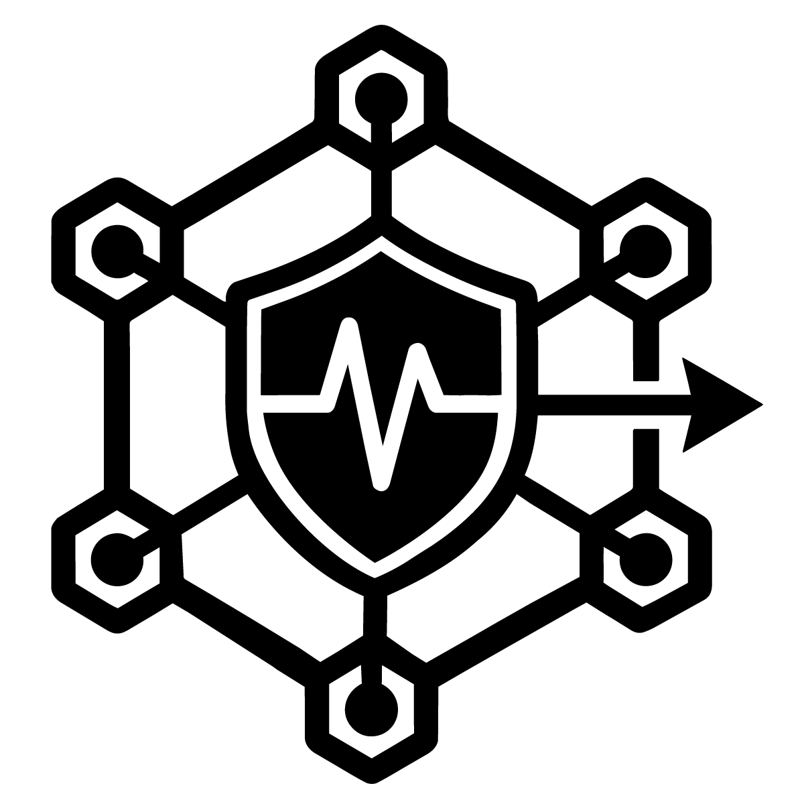

# WattGuard

<p align="center">
  
</p>

<p align="center">
  Agente de gestión energetica inteligente con detección de anomalías por Edge AI
</p>

<p align="center">
  
  
  
  
</p>

---

## ¿Qué es WattGuard?

WattGuard es un sistema de monitoreo energético inteligente que mide el consumo eléctrico en tiempo real, detecta anomalías mediante NILM híbrido (Non-Intrusive Load Monitoring) y permite controlar cargas de forma remota desde una app móvil en red local, o desde internet (opcional).

Desarrollado para el track **Qualcomm — Sustainable Power Cities HACKATHON** en Talent Land 2026.

---

## Arquitectura del sistema (para showcase del prototipo)

```
[Caja 1 · Switch]          [Caja 2 · Nodo gemelo]
  ESP32-C3                   ESP32-C3
  SCT-013 50A                SCT-013 50A (canal A)
  Relay                      SCT-013 30A (canal B)
  HLK-3M05B                  2× Relay
       │                     HLK-3M05B
       └──── WiFi MQTT ───────────┘
                    │
         [Arduino UNO Q · Nodo central]
           Mosquitto MQTT broker
           Node.js + Express API
           SQLite + NILM detector
                    │
              REST API local
                    │
         [App Ionic / Angular]
           monitoreo en tiempo real
           control de relays
           historial y alertas
```

---

## Estructura del repositorio

```
WattGuard/
├── firmware/
│   ├── nodo/          # Firmware ESP32-C3
│   └── central/       # Backend Node.js (Arduino UNO Q)
├── movile-app/          # App Ionic + Angular
├── docs/
│   ├── diagramas/     # Esquemáticos, diagramas de clases y flujo
│   └── logo.png
└── README.md
```

---

## Hardware utilizado (MVP)

| Componente | Cantidad | Uso |
|---|---|---|
| ESP32-C3 SuperMini | 2 | Un nodo por caja |
| Arduino UNO Q | 1 | Nodo central |
| SCT-013 50A | 2 | Switch + canal A gemelo |
| SCT-013 30A | 1 | Canal B gemelo |
| HLK-3M05B | 2 | Alimentación 127V→5V |
| Relay 5V 1 canal | 3 | Control de carga |
| DS18B20 | 2 | Temperatura interna |
| Caja IP55 10×10×5cm | 2 | Gabinete de los nodos |

---

## Stack tecnológico

| Capa | Tecnología |
|---|---|
| Firmware | C++ · Arduino |
| Comunicación | MQTT · WiFi 802.11 b/g/n |
| Backend | Node.js · Express · SQLite |
| IA / Detección | NILM híbrido · Edge Impulse |
| App móvil | Ionic · Angular |

---

## Inicio rápido

### Firmware (ESP32-C3)
```bash
cd firmware/nodo
# Abrir el directorio /nodo con el IDE de arduino
# Edita Config.h con el NODE_ID y TYPE_ID correspondiente y credenciales WIFI
# Build & Upload
```

### Backend (Arduino UNO Q / PC local)
```bash
cd firmware/central
npm install
npm start
```

### App
```bash
cd frontend
npm install
ionic serve
```

---

## Equipo

**Equipo Cognitio** · Talent Land 2026  
Track: Qualcomm — Sustainable Power Cities HACKATHON

---

## Licencia

MIT
